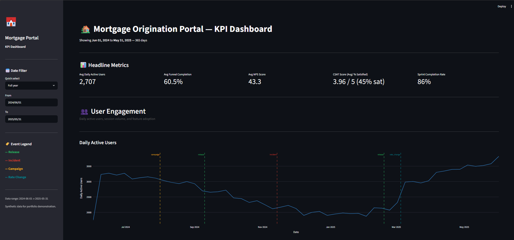

# Mortgage Origination Portal — KPI Dashboard

A portfolio project demonstrating end-to-end data product development: synthetic data generation, a normalized PostgreSQL database, and an interactive executive dashboard built with Streamlit and Plotly.

---

## The Problem

Product teams at mortgage companies are drowning in data but starving for insight. Loan origination, marketing, IT, and secondary marketing each track their own metrics — but no single view connects engagement, conversion, customer satisfaction, and delivery health in a way that drives action.

## The Solution

An automated reporting layer that synthesizes quantitative metrics with qualitative product events. When a chart shows an anomaly, the dashboard surfaces the *why* — a product release, an outage, a rate environment shift — not just the *what*.

The result: mortgage product managers and business leaders get a single view across engagement, conversion, satisfaction, and delivery health — with every metric movement tied to a business event.

## The Inspiration

While reviewing a job description for a product management role at a national mortgage lender, one of the listed responsibilities was:

> *"Establish and track objectives and key results (KPIs) such as engagement, conversion, customer satisfaction, and internal efficiency to support our Service Excellence philosophy and drive measurable business impact."*

That description maps directly to the four measurement dimensions in this project. This dashboard is what that responsibility looks like when built.


---

## Tech Stack

| Layer | Technology |
|---|---|
| Data store | PostgreSQL (`mortgage_portal_kpi`) |
| Dashboard interface | Streamlit |
| Charts and visualizations | Plotly |
| DB connection driver | psycopg2-binary |
| Data generation | pandas, numpy |
| Environment config | python-dotenv |

---

## Project Structure

```
mortgage-portal-kpi/
├── generate_mock_data.py      # Synthetic data generator — seeds the PostgreSQL database
├── dashboard.py               # Streamlit dashboard — connects to PostgreSQL, renders all charts
├── .env                       # Local DB credentials (not committed to repo)
├── .env.example               # Template for environment setup
├── requirements.txt           # Python dependencies
└── data_dictionary.md         # Full field definitions, business logic, and event reference
```

---

## The Data

Since no proprietary data exists for a portfolio project, a realistic synthetic dataset was generated to simulate 12 months of daily portal activity (June 1, 2024 — May 31, 2025).

### Database: `mortgage_portal_kpi`

Five tables, 1,127 total rows:

| Table | Rows | What it tracks |
|---|---|---|
| `daily_engagement` | 365 | DAU, sessions, session duration, feature adoption |
| `daily_conversion` | 365 | Application funnel: started → submitted → approved, drop-off stage and reason |
| `daily_satisfaction` | 365 | NPS, CSAT, support tickets opened/resolved, avg resolution time |
| `sprint_metrics` | 27 | Velocity, bug rates, backlog health across 27 two-week sprints |
| `product_events` | 5 | Releases, incidents, campaigns, and rate changes used to annotate charts |

`sprint_metrics` is the parent table. `daily_engagement` and `daily_conversion` both carry a `sprint_id` foreign key, enabling analysis of whether specific sprint themes drove measurable changes in user behavior.

### Realism Layers Built Into the Data

The synthetic data is not random noise — it follows behavioral patterns grounded in how mortgage origination actually works:

- **Seasonality curve:** Spring (March–June) is peak demand at ~1.25–1.30× baseline. Winter (December–February) slows to ~0.70–0.75× baseline.
- **Weekend suppression:** DAU and application starts drop to ~45% and ~30% of weekday values on Saturdays and Sundays.
- **Two product releases** (v2.1 in September 2024, v2.5 in February 2025) that lift feature adoption and conversion rates.
- **One P1 incident** (November 14, 2024): a document upload outage that causes a 1,000%+ spike in support tickets, a 55% drop in submitted applications, and a sustained NPS decline over two weeks.
- **A rate environment shift** (March 2025): the 30-year fixed rate crosses 7.5%, suppressing application volume ~12% through the end of the dataset.
- **Sprint velocity arc:** velocity ramps as the team forms in early sprints, plateaus mid-year, and dips during the incident-response sprint when engineering capacity was consumed by remediation.
- **Reproducibility:** all random generation uses fixed seeds (`random.seed(42)`, `np.random.seed(42)`) so the dataset is identical on every run.

### Key Events Reference

| Date | Type | Event | Primary Metric Impact |
|---|---|---|---|
| Aug 1, 2024 | Campaign | Summer homebuyer campaign | Sessions +15%, applications started +18% |
| Sep 10, 2024 | Release | v2.1 launch | Funnel conversion +10%, NPS +6 pts |
| Nov 14, 2024 | Incident | P1 upload service outage | Tickets +1,000%, applications submitted -55%, NPS -9 pts |
| Feb 18, 2025 | Release | v2.5 launch | DAU +8%, feature adoption lifts, NPS +4 pts |
| Mar 5, 2025 | Rate change | 30-yr fixed crosses 7.5% | Applications started -12%, DAU -7% |

For full field definitions and business logic, see the [Data Dictionary](data_dictionary.md).

---

## Dashboard Sections

### Headline Scorecards
Five period-level KPIs at the top of every view: Avg Daily Active Users, Avg Funnel Completion, Avg NPS, CSAT Score (mean + % satisfied), and Sprint Completion Rate.

### Section 1 — User Engagement
DAU trend with event annotations, weekly session volume, average session duration, and feature adoption rate. All trend lines display weekly averages to reduce noise while preserving signal.

### Section 2 — Application Conversion
Funnel completion rate trend, application volume waterfall (started → submitted → approved), drop-off stage and reason distributions, and daily application volume (started vs. submitted overlaid).

### Section 3 — Customer Satisfaction
NPS trend with benchmark lines (0 = neutral, 30 = good), CSAT score trend with a 3.5 action threshold, support tickets opened vs. resolved (grouped bar), and average ticket resolution time.

### Section 4 — Agile Delivery Health
Sprint velocity (planned vs. completed overlay), bug volume per sprint (opened vs. resolved), backlog size over time, and a full sprint detail table with themes and completion percentages.

All charts support a date range filter (sidebar) with quick-select presets: Full Year, Last 90 / 60 / 30 Days, or Custom Range. Product events are overlaid as color-coded vertical annotations across all time series.

---

## Setup and Usage

### Prerequisites
- Python 3.9+
- PostgreSQL (local instance with the `mortgage_portal_kpi` database created)
- The five tables created per the schema in `data_dictionary.md`

### Installation

```bash
# Clone the repo
git clone https://github.com/JoeC5/mortgage-portal-kpi.git
cd mortgage-portal-kpi

# Create and activate a virtual environment
python -m venv .venv
.venv\Scripts\activate        # Windows
# source .venv/bin/activate   # macOS / Linux

# Install dependencies
pip install -r requirements.txt
```

### Environment Configuration

Copy `.env.example` to `.env` and fill in your local PostgreSQL credentials:

```
DB_HOST=localhost
DB_PORT=5432
DB_NAME=mortgage_portal_kpi
DB_USER=postgres
DB_PASSWORD=your_password
```

### Generate the Data

```bash
python generate_mock_data.py
```

This truncates and reloads all five tables. Run time is typically under 10 seconds. Output confirms row counts per table.

### Run the Dashboard

```bash
streamlit run dashboard.py
```

The dashboard opens at `http://localhost:8501` by default.

---

## What's Next

The next phase of the project adds a Claude-powered AI narrative agent to the dashboard. Rather than requiring a user to read four sections of charts and synthesize the story themselves, the agent will generate a plain-English executive briefing on demand — interpreting current metric levels, flagging anomalies, and surfacing the relevant product events that explain them.

---

## Disclaimer

All data in this project is entirely synthetic and generated for portfolio and demonstration purposes. It does not represent any real company, customer, or loan origination system.
